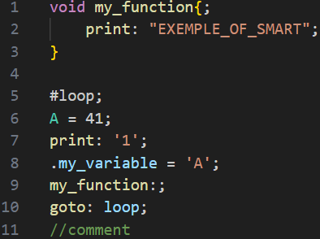

# smart-cpmpr README

This extention add the coloration for SmartyKit Smart programming.

## Features

Add a coloration for comment, char, str, function (void), label, and variable.

## Requirements

For run Smart SmartyKit, you need to install [here](https://github.com/smartin187/smartykit_compiler).

## Release Notes

### 1.0.0

Initial release of Smart SmartyKit coloration.

---

**Enjoy!**
